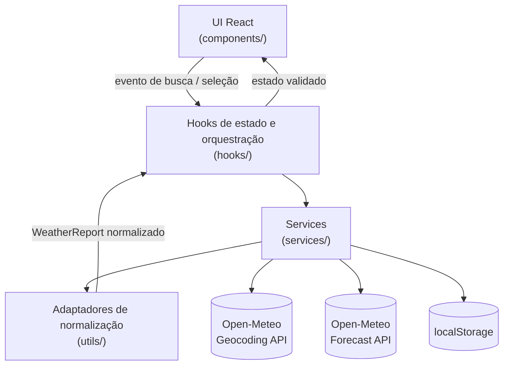

# Plano Técnico — Weather App

**Fonte da verdade:** `specs/weather-app-spec.md`  
**Data:** 2026-09-02  
**Status:** Pronto para quebra em tarefas

## Architecture

O MVP será uma aplicação web client-side, responsiva e sem autenticação,
construída com React + Vite. A arquitetura será organizada em camadas simples:



Responsabilidades principais:

- **Componentes de UI:** renderizam busca, sugestões, clima atual, previsão de
  cinco dias, alternância de unidade e estados de feedback. Atendem FR-01,
  FR-02, FR-03, FR-05, FR-06, FR-07, FR-08, FR-11, FR-13 e US-07.
- **Hooks:** concentram estado da tela, controle de requisições concorrentes,
  retry, seleção de cidade e conversão de unidade. Atendem FR-09, FR-10,
  FR-12 e FR-14.
- **Services:** encapsulam chamadas HTTP, timeout de 10 segundos, parse das
  respostas e acesso resiliente ao `localStorage`. Atendem FR-02, FR-10,
  FR-15 e requisitos não funcionais de confiabilidade.
- **Adaptadores:** traduzem respostas da Open-Meteo para um modelo interno
  estável, marcam campos ausentes como opcionais e mapeiam códigos climáticos
  para texto e ícone acessível. Atendem FR-04, FR-05, FR-07 e FR-15.

A aplicação exibirá uma cidade por vez. Dados da tela só serão substituídos
depois que a nova previsão for validada, evitando que respostas antigas
sobrescrevam uma busca mais recente.

## Tech Stack

- **TypeScript strict:** reduz erros de contrato em respostas externas e
  estados de UI.
- **React + Vite:** entrega leve para SPA pública, com bom ciclo de
  desenvolvimento e build simples.
- **Tailwind CSS:** implementação mobile-first do tema escuro com glassmorphism,
  mantendo consistência visual do projeto.
- **Open-Meteo Geocoding API:** sugestões de cidades sem chave de API.
- **Open-Meteo Forecast API:** clima atual, previsão diária e timezone local.
- **localStorage:** preferência de unidade e cache da última consulta no mesmo
  navegador, sem backend.
- **Vitest + Testing Library:** testes unitários de services, adaptadores, hooks
  e comportamento acessível dos componentes.
- **Playwright:** testes E2E dos fluxos críticos em viewport mobile e desktop.
- **Biome:** lint e formatação conforme configuração do repositório.

Não haverá backend, banco de dados, autenticação, analytics ou service worker no
MVP, pois esses itens estão fora do escopo ou seriam over-engineering para a
primeira versão. A hospedação de produção deve servir a aplicação
exclusivamente via HTTPS, conforme requisito não funcional de segurança da
spec; a escolha do provedor de hospedagem fica fora do escopo deste plano de
arquitetura client-side.

## Project Structure

Estrutura proposta para a implementação:

```text
src/
  components/
    SearchForm.tsx
    SearchSuggestions.tsx
    UnitToggle.tsx
    CurrentWeatherCard.tsx
    ForecastList.tsx
    ForecastDayCard.tsx
    WeatherStatus.tsx
  hooks/
    useWeatherSearch.ts
    useTemperatureUnit.ts
  services/
    openMeteoClient.ts
    weatherService.ts
    storageService.ts
  types/
    weather.ts
  utils/
    temperature.ts
    wind.ts
    weatherCode.ts
    dateTime.ts
  App.tsx
  main.tsx
  index.css
tests/
  unit/
  e2e/
```

Responsabilidades:

- `components/`: apenas apresentação, eventos de usuário e acessibilidade.
- `hooks/`: coordenação de estado, abort/ignore de respostas obsoletas e retry.
- `services/`: I/O externo, timeout, cache e normalização de erros.
- `types/`: contratos compartilhados entre services, hooks e UI.
- `utils/`: funções puras de conversão, formatação e mapeamento.
- `tests/`: cobertura unitária e E2E derivada dos critérios de aceite.

## Data Model

Contratos internos previstos, sem implementação final:

```ts
type TemperatureUnit = 'celsius' | 'fahrenheit';

interface CitySuggestion {
  id: number;
  name: string;
  country: string;
  countryCode?: string;
  region?: string;
  latitude: number;
  longitude: number;
  timezone: string;
}

interface WeatherLocation {
  city: CitySuggestion;
  displayName: string;
}

interface CurrentWeather {
  temperatureCelsius: number;
  apparentTemperatureCelsius: number;
  condition: WeatherCondition;
  precipitationLast24hMm: number | null;
  humidityPercent: number | null;
  windSpeedKmh: number | null;
  windDirectionDegrees: number | null;
  windDirectionCardinal: string | null;
  uvIndex: number | null;
  measuredAtLocal: string;
}

interface DailyForecast {
  dateLocal: string;
  minTemperatureCelsius: number | null;
  maxTemperatureCelsius: number | null;
  condition: WeatherCondition;
  rainProbabilityPercent: number | null;
  precipitationMm: number | null;
  sunriseLocal: string | null;
  sunsetLocal: string | null;
}

interface WeatherCondition {
  code: number | null;
  label: string;
  iconAlt: string;
}

interface WeatherReport {
  location: WeatherLocation;
  current: CurrentWeather;
  daily: DailyForecast[];
  source: 'Open-Meteo';
  fetchedAt: string;
  timezone: string;
}

interface CachedWeatherReport {
  report: WeatherReport;
  cachedAt: string;
  expiresAt: string;
}

type WeatherViewStatus =
  | 'idle'
  | 'validating'
  | 'loading-suggestions'
  | 'loading-weather'
  | 'invalid-input'
  | 'empty-results'
  | 'network-error'
  | 'timeout-error'
  | 'rate-limit-error'
  | 'invalid-response-error'
  | 'cached-data';
```

Decisões de modelo:

- Temperaturas serão armazenadas internamente em Celsius e convertidas para
  Fahrenheit apenas na apresentação.
- Campos opcionais ou ausentes da fonte serão `null` no modelo interno e
  renderizados como “Não disponível”.
- `daily` deve conter exatamente cinco itens após normalização; resposta com
  menos dias válidos será tratada como resposta inválida.
- Horários serão preservados como strings ISO/localizadas da fonte e formatados
  para pt-BR na UI, usando o timezone da cidade.

## Data Flow

Fluxo de sugestões:

1. Usuário digita no campo de busca.
2. Entrada é trimada e validada entre 2 e 80 caracteres.
3. O hook aplica debounce de 300 ms antes de consultar o service de geocoding,
   atendendo ao requisito de limitar consultas repetitivas no cliente.
4. Após 2 caracteres e o debounce expirar, o hook solicita sugestões ao service
   de geocoding.
5. Cada nova consulta cancela a anterior via `AbortController`, garantindo que
   uma resposta obsoleta não substitua sugestões mais recentes.
6. A UI exibe até cinco sugestões com cidade, país e região quando disponível.
7. Nenhum resultado gera estado específico de vazio, sem tentar tratar texto
   livre como coordenada.

Fluxo de previsão:

1. Usuário seleciona uma sugestão válida.
2. O hook solicita forecast para latitude, longitude e timezone da cidade.
3. O service aplica timeout de 10 segundos e normaliza a resposta.
4. Adaptadores validam dados mínimos, selecionam hoje + quatro dias no fuso da
   cidade e mapeiam condições climáticas.
5. Se a resposta for válida, a tela substitui a previsão anterior, registra
   `fetchedAt` e salva cache por até 24 horas.
6. Se a resposta falhar, o hook tenta carregar cache válido da última consulta.
7. Com cache válido, a UI exibe os dados com indicação de desatualização e idade
   em horas/minutos; sem cache, exibe erro com “Tentar novamente”.

Fluxo de unidade:

1. A aplicação inicia em Celsius ou lê a preferência persistida.
2. Preferência inválida ou falha de leitura usa Celsius.
3. A alternância atualiza o estado local e tenta persistir a escolha.
4. Valores visíveis são convertidos sem recarregar a página.

## External APIs

### Open-Meteo Geocoding API

Endpoint:

```text
GET https://geocoding-api.open-meteo.com/v1/search
```

Parâmetros previstos:

- `name`: texto informado pelo usuário, trimado.
- `count=5`: limite de sugestões exibidas.
- `language=pt`: preferir nomes/localização em português quando disponível.
- `format=json`: formato da resposta.

Exemplo resumido de resposta:

```json
{
  "results": [
    {
      "id": 3451190,
      "name": "São Paulo",
      "latitude": -23.5475,
      "longitude": -46.63611,
      "country": "Brasil",
      "country_code": "BR",
      "admin1": "São Paulo",
      "timezone": "America/Sao_Paulo"
    }
  ]
}
```

Quando não há cidades compatíveis, a Open-Meteo pode omitir a chave
`results` por completo; o service deve tratar esse caso como lista vazia, não
como erro.

Mapeamento para `CitySuggestion`:

| Campo da resposta | Campo em `CitySuggestion` | Observação |
| --- | --- | --- |
| `id` | `id` | usado como key estável na lista de sugestões |
| `name` | `name` | grafia oficial preservada, sem alteração de case |
| `country` | `country` | |
| `country_code` | `countryCode` | opcional |
| `admin1` | `region` | opcional; ausente para países sem divisão administrativa relevante |
| `latitude`, `longitude` | `latitude`, `longitude` | reenviados no forecast |
| `timezone` | `timezone` | reenviado como parâmetro `timezone` do forecast |

### Open-Meteo Forecast API

Endpoint:

```text
GET https://api.open-meteo.com/v1/forecast
```

Parâmetros previstos:

- `latitude` e `longitude`: coordenadas da sugestão selecionada.
- `timezone`: timezone da cidade quando disponível, ou `auto` como fallback
  controlado.
- `forecast_days=5`: hoje e quatro dias seguintes.
- `current=temperature_2m,apparent_temperature,relative_humidity_2m,precipitation,weather_code,wind_speed_10m,wind_direction_10m,uv_index`.
- `daily=weather_code,temperature_2m_max,temperature_2m_min,precipitation_sum,precipitation_probability_max,sunrise,sunset`.
- `wind_speed_unit=kmh`: vento em km/h.
- `temperature_unit=celsius`: base única para normalização e conversão local.
- `precipitation_unit=mm`: precipitação em milímetros.

Exemplo resumido de resposta:

```json
{
  "latitude": -23.5475,
  "longitude": -46.63611,
  "timezone": "America/Sao_Paulo",
  "current": {
    "time": "2026-09-02T14:00",
    "temperature_2m": 22.4,
    "apparent_temperature": 21.8,
    "relative_humidity_2m": 63,
    "precipitation": 0.2,
    "weather_code": 61,
    "wind_speed_10m": 14.6,
    "wind_direction_10m": 135,
    "uv_index": 5.2
  },
  "daily": {
    "time": ["2026-09-02", "2026-09-03", "2026-09-04", "2026-09-05", "2026-09-06"],
    "weather_code": [61, 3, 2, 1, 0],
    "temperature_2m_max": [24.1, 23.5, 25.0, 26.2, 27.0],
    "temperature_2m_min": [16.3, 15.8, 16.9, 17.4, 18.0],
    "precipitation_sum": [4.2, 0, 0, 0, 0],
    "precipitation_probability_max": [70, 20, 10, 5, 0],
    "sunrise": ["2026-09-02T06:12", "2026-09-03T06:12", "2026-09-04T06:13", "2026-09-05T06:13", "2026-09-06T06:14"],
    "sunset": ["2026-09-02T17:48", "2026-09-03T17:47", "2026-09-04T17:47", "2026-09-05T17:46", "2026-09-06T17:46"]
  }
}
```

Mapeamento para `CurrentWeather` (bloco `current`):

| Campo da resposta | Campo em `CurrentWeather` | Observação |
| --- | --- | --- |
| `time` | `measuredAtLocal` | já vem no timezone solicitado |
| `temperature_2m` | `temperatureCelsius` | |
| `apparent_temperature` | `apparentTemperatureCelsius` | |
| `weather_code` | `condition` | mapeado via `utils/weatherCode.ts` para `label` + `iconAlt` |
| `precipitation` | `precipitationLast24hMm` | aproximação: representa a precipitação da hora atual, não um acumulado de 24h real; ver observação abaixo |
| `relative_humidity_2m` | `humidityPercent` | |
| `wind_speed_10m` | `windDirectionCardinal`… | ver linha seguinte |
| `wind_direction_10m` | `windDirectionDegrees` | `windDirectionCardinal` é derivado em `utils/wind.ts`, não vem da API |
| `wind_speed_10m` | `windSpeedKmh` | |
| `uv_index` | `uvIndex` | ausente em algumas execuções; mapear como `null` quando não vier |

Mapeamento para `DailyForecast` (bloco `daily`, arrays por índice `i` de 0 a 4):

| Campo da resposta | Campo em `DailyForecast` | Observação |
| --- | --- | --- |
| `time[i]` | `dateLocal` | |
| `temperature_2m_min[i]` | `minTemperatureCelsius` | arredondar para 1 casa decimal na exibição |
| `temperature_2m_max[i]` | `maxTemperatureCelsius` | arredondar para 1 casa decimal na exibição |
| `weather_code[i]` | `condition` | mesmo mapeamento de `utils/weatherCode.ts` do clima atual |
| `precipitation_probability_max[i]` | `rainProbabilityPercent` | |
| `precipitation_sum[i]` | `precipitationMm` | |
| `sunrise[i]` | `sunriseLocal` | |
| `sunset[i]` | `sunsetLocal` | |

Campos de nível superior da resposta (`latitude`, `longitude`, `timezone`) alimentam
`WeatherReport.timezone`; `WeatherReport.source` é a constante `'Open-Meteo'` e
`WeatherReport.fetchedAt` é o timestamp local do momento em que a resposta foi
recebida pelo cliente, não um campo da API.

Observações:

- A precipitação das últimas 24 horas exigida por FR-05 não corresponde
  diretamente a `current.precipitation` (que é apenas a hora atual). Para o
  MVP, o adaptador usará esse valor como aproximação e o rótulo da UI deixará
  claro o período coberto; uma alternativa mais precisa (somar 24 valores de
  `hourly.precipitation`) fica registrada como risco a validar antes do
  lançamento.
- `uv_index` pode não estar disponível para todos os locais ou horários; o
  adaptador deve mapear a ausência como `null`, exibido como “Não disponível”.
- Caso um campo opcional não venha na resposta, o adaptador deve preservar os
  demais dados e marcar o campo como indisponível.
- Rate limiting, timeout, erro HTTP e JSON inválido serão normalizados em erros
  de domínio para a UI.

## State Management

Estado local com React será suficiente para o MVP.

Estados previstos:

- `query`: texto digitado.
- `suggestions`: lista atual de até cinco cidades.
- `selectedCity`: cidade selecionada para previsão e retry.
- `report`: previsão validada exibida na tela.
- `temperatureUnit`: Celsius ou Fahrenheit.
- `status`: estado discriminado da tela.
- `error`: erro normalizado, quando houver.
- `isShowingCache`: indica que a previsão exibida veio do cache.
- `AbortController` ativo: cancela sugestões e forecast obsoletos ao iniciar
  uma nova consulta, evitando respostas antigas sobrescreverem dados recentes.

Persistência local:

- `weather.temperatureUnit`: `celsius` ou `fahrenheit`.
- `weather.lastReport`: `CachedWeatherReport`, com expiração de 24 horas.

Decisões:

- Não usar Redux, Zustand ou React Query no MVP; a complexidade de estado é
  pequena e concentrada.
- Requisições concorrentes serão controladas no hook, mantendo components mais
  simples e testáveis.
- A previsão anterior permanece visível até que a nova previsão seja validada,
  conforme FR-12.
- A busca de sugestões usa debounce de 300 ms como único mecanismo de limite de
  consultas repetitivas no cliente; não há necessidade de um limitador mais
  sofisticado para o volume de tráfego esperado do MVP.

## Error Handling

Estratégia geral:

- Validar entrada antes de chamar APIs: vazio, menos de 2 caracteres ou mais de
  80 caracteres geram `invalid-input`.
- Aplicar timeout de 10 segundos em geocoding e forecast, medido separadamente
  do tempo de renderização da UI, para acompanhar os orçamentos de LCP e de
  atualização em até 200 ms definidos nos requisitos não funcionais.
- Cancelar ou ignorar respostas antigas quando uma nova consulta começar.
- Normalizar falhas em categorias exibíveis: rede, timeout, rate limiting,
  resposta inválida, nenhum resultado e cache.
- Oferecer “Tentar novamente” quando houver cidade selecionada ou consulta
  repetível.
- Preservar dados válidos existentes até que uma nova previsão seja confirmada.
- Registrar erros relevantes (rede, timeout, resposta inválida) via
  `console.error` com contexto mínimo (cidade, categoria do erro, status),
  sem dados sensíveis; o MVP não terá serviço externo de log.

Fallback por cache:

- Cache válido: até 24 horas desde `cachedAt`.
- Cache expirado: descartar e não exibir como previsão válida.
- Quando usado, exibir origem, timestamp original e idade do cache em horas e
  minutos.
- Se `localStorage` falhar, continuar o fluxo principal sem persistência.

Mensagens e acessibilidade:

- Estados de carregamento, erro, cidade selecionada e unidade devem ser
  anunciados por região de status para tecnologias assistivas.
- Controles devem ter nome acessível, foco visível e operação por teclado.
- Dados indisponíveis devem aparecer como “Não disponível”, sem bloquear o
  restante da previsão.

## Testing Strategy

Testes unitários com Vitest + Testing Library:

- Fazer mock da camada de `services/` em todos os testes de hooks e
  componentes; nenhum teste unitário chama a Open-Meteo real.
- Validação do input: trim, limites 2-80 e caracteres especiais.
- Conversão Celsius/Fahrenheit com uma casa decimal.
- Mapeamento de direção do vento em graus para ponto cardeal.
- Mapeamento de códigos climáticos para texto e `iconAlt`.
- Normalização da Open-Meteo para `WeatherReport` com exatamente cinco dias.
- Tratamento de campos opcionais ausentes como `null` / “Não disponível”.
- Expiração do cache após 24 horas e tolerância a falhas de `localStorage`.
- Cancelamento/ignorar respostas obsoletas em sugestões e previsão.
- Estados de UI: inicial, carregamento, vazio, erro, cache e retry.
- Acessibilidade básica: nomes acessíveis, roles/status e navegação por teclado.

Testes E2E com Playwright:

- Interceptar chamadas de rede com `page.route` em todos os cenários, para
  resultados determinísticos sem depender da Open-Meteo real.
- Buscar cidade válida, selecionar sugestão e ver clima atual + cinco dias.
- Cidade homônima exibindo cidade, país e região.
- Entrada inválida não dispara consulta e mostra validação.
- Alternância para Fahrenheit converte dados sem recarregar e persiste após
  reload.
- Falha de rede com cache válido exibe última previsão e idade do cache.
- Falha de rede sem cache exibe erro e botão “Tentar novamente”.
- Viewports 320, 360, 768 e 1440 px sem overflow horizontal nem sobreposição.
- Executar ao menos os fluxos críticos nos projetos Chromium, Firefox e WebKit
  do Playwright, cobrindo a matriz de navegadores exigida pela spec.

Validações finais antes de concluir tarefas:

```text
pnpm lint
pnpm build
pnpm test
```

## Risks & Trade-offs

| Risco / trade-off | Impacto | Decisão / mitigação |
| --- | --- | --- |
| Dependência da Open-Meteo | Alto | Usar timeout, cache de última consulta, erros claros e validação operacional antes do lançamento. |
| Campos da API diferentes do esperado | Alto | Adaptadores isolados, dados opcionais como `null` e testes com fixtures de resposta. |
| Precipitação das últimas 24h ou UV indisponíveis no endpoint escolhido | Médio | Tratar como opcional quando a fonte não fornecer; validar possibilidade de compor via dados horários antes do lançamento. |
| Conexão lenta em dispositivos móveis | Médio | Bundle simples, sem backend próprio, UI leve e feedback de carregamento. |
| Respostas obsoletas sobrescrevendo dados recentes | Médio | `AbortController` e/ou `requestId` no hook de orquestração. |
| `localStorage` indisponível | Baixo | Falha silenciosa controlada, Celsius como padrão e app funcional sem persistência. |
| Acessibilidade em tema escuro glassmorphism | Médio | Contraste mínimo, foco visível, testes automatizados e revisão manual de teclado. |
| Crescimento de tráfego acima do previsto | Médio | Limitar consultas repetitivas no cliente e reavaliar cache/CDN/backend em versão futura. |
| Simplicidade sem biblioteca de cache HTTP | Baixo | Estado local reduz dependências; se os fluxos crescerem, React Query pode ser reavaliado depois do MVP. |

Itens fora do plano do MVP:

- Login, favoritos, histórico completo, geolocalização automática, notificações,
  analytics, PWA/service worker, backend próprio e previsão além de cinco dias.